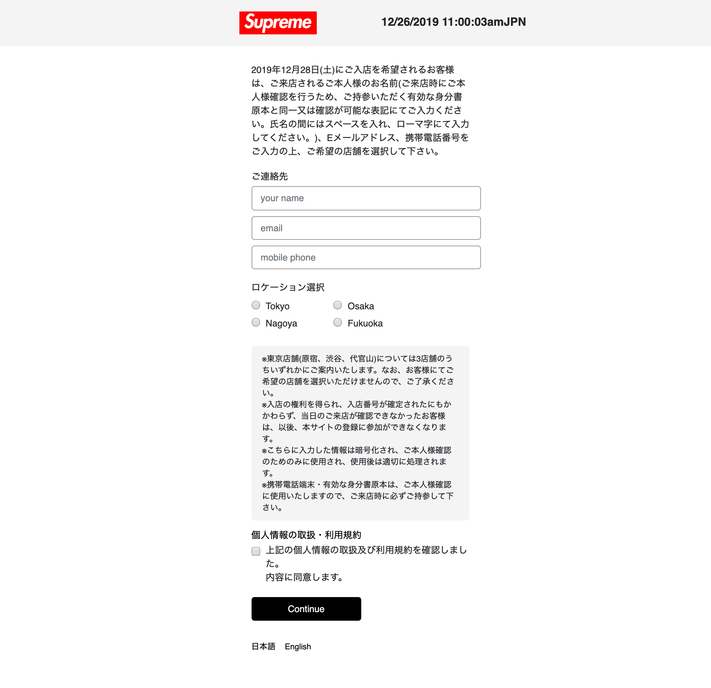

本格的なスピード勝負になるまでは以下の方法で登録できそう。

1. 名前、メールアドレス、電話番号、エリア（area_tokyo, area_osaka, area_nagoya, area_fukuokaのどれか）を書き換える
1. 全てコピーしてブックマークレットとして保存する
1. 時間になったら `https://japan.supremenewyork.com/` を開く
1. 以下の画像の表示になったらブックマークレットを実行

```
javascript:
(function () {
  if (document.getElementById('register')) {
    document.querySelector('#register input:nth-child(5)').value = 'your name';
    document.querySelector('#register input:nth-child(6)').value = 'your email';
    document.querySelector('#register input:nth-child(7)').value = 'your tel';
    /* tokyo */
    document.getElementById('area_tokyo').checked = true;
    document.getElementById('agree').checked = true;
    document.querySelector('#register input[name=commit]').click();
  }
})();
```


